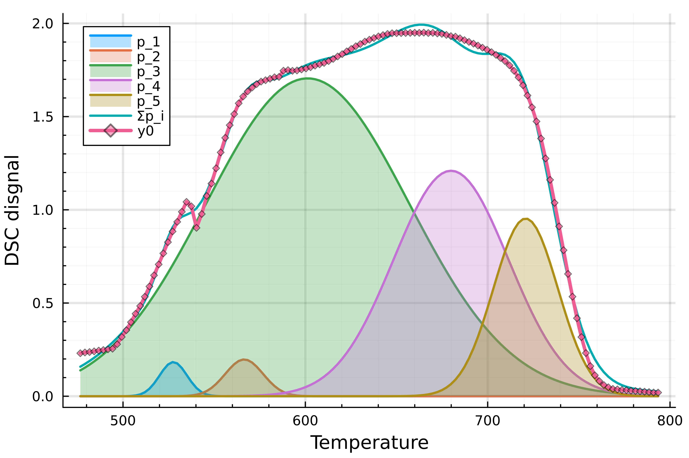

# PeaksSeparation

[](https://github.com/Manarom/PeaksSeparation.jl/actions/workflows/CI.yml?query=branch%3Amain)

Small package for peaks separation

<p float="left">
  
</p>

# Quick start:
Clone this repository to your local machine in `project_folder` (any name)

In julia REPL run:
```julia
  import Pkg
  cd(project_folder) # sets working folder to project_folder
  Pkg.activate(".")
  Pkg.instantiate() # to install all necessary dependencies
  include(".\\src\\PeaksSeparation.jl")
  using .PeaksSeparation
  (sol,p) = PeaksSeparation.fit_peaks(x,y,N=5) # fits five peaks to y(x) curve
  p[0] # gives baseline object
  p[1] # first peak etc
  using Plots
  plot(p)  # plots peaks
  PeaksSeparation.fit_peaks!(p) # to perform additional fitting
```
Pluto [notebook](https://github.com/Manarom/PeaksSeparation.jl/blob/main/src/dsc_peaks.jl) is also available